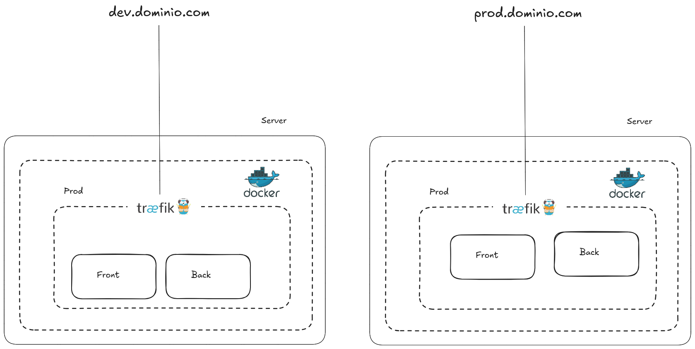
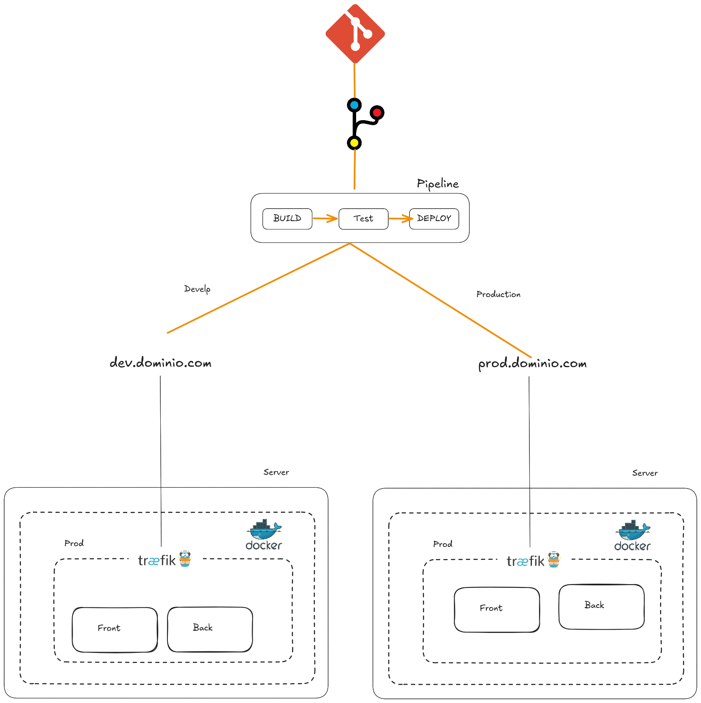
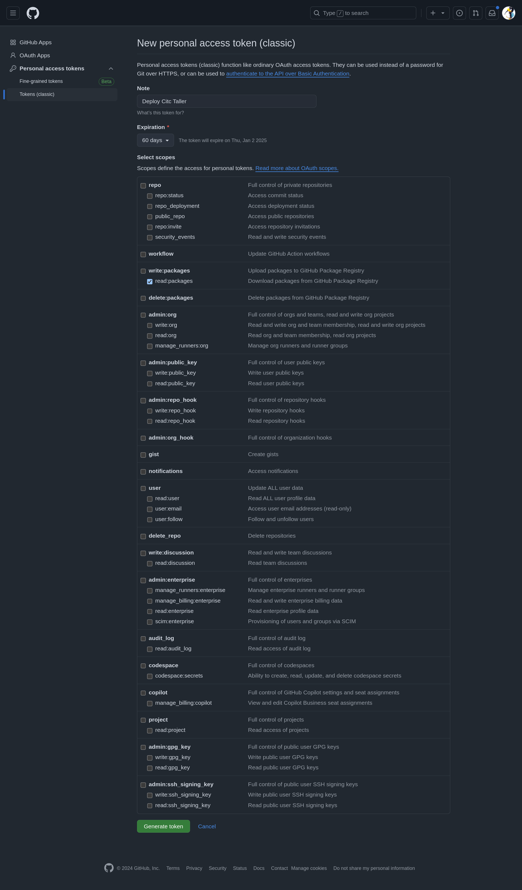

# Taller de Infraestructura CITC 2024

En este taller trabajaremos con la infraestructura representada en los siguientes diagramas:

1. **Diagrama de Desarrollo**: Utilizaremos una configuración de dos servidores o un servidor, dependiendo de los asistentes, como se muestra a continuación:
   

2. **Diagrama de Flujo Completo**: Este diagrama describe el flujo completo, desde la subida del codigo al repo hasta el despliegue en el servidor. Dependiendo si el código se sube a `develop` o `main`, se implementará en el servidor de desarrollo o producción:
   

## Requisitos de Configuración

### Instalación de Docker
Ejecute los siguientes comandos para instalar y habilitar Docker.

```bash
curl -fsSL https://get.docker.com -o install-docker.sh
sudo sh install-docker.sh

sudo systemctl enable docker.service
sudo systemctl enable containerd.service
```

### Creación y Configuración del Usuario `deploy`
1. **Crear un usuario llamado `deploy`**:
   ```bash
   sudo adduser deploy
   sudo usermod -aG docker deploy
   sudo su - deploy
   ```

2. **Configurar una red de Docker para Traefik**:
   ```bash
   docker network create traefik-net
   ```

3. **Generar una clave SSH**:
   ```bash
   ssh-keygen -t ed25519 -C "TU_CORREO@ejemplo.com"
   ```

4. **Copiar la clave SSH pública**:
   Ejecute el siguiente comando para visualizar y copiar el contenido de la clave SSH pública. Esto será necesario para integraciones posteriores:
   ```bash
   cat ~/.ssh/id_ed25519.pub
   ```

### Configuración para crear el token de Github Packages
Para permitir la autenticación mediante SSH en GitHub:

1. Visite [token de acceso en GitHub packages](https://github.com/settings/tokens/new).
2. Configure un token con los permisos necesarios para despliegues, como se muestra en la siguiente imagen:

   

## Descripción de los Archivos YAML de Servicios

Este archivo `docker-compose.yml` define `backend`, `traefik` y `frontend`.


El servicio `backend` y `frondend` utilizaran las imagenes Docker almacenadas en GitHub Registry
   
   

### Servicio Backend
```yaml
services:
  backend:
    image: ghcr.io/samuelloza/citc2024-taller-back:develop
    restart: always
    labels:
      - traefik.enable=true
      - traefik.http.routers.back-dev.rule=Host(`MY-DOMAIN.COM`) && PathPrefix(`/api/v1`)
      - traefik.http.routers.back-dev.tls=true
      - traefik.http.routers.back-dev.tls.certresolver=le
      - traefik.http.services.back-dev.loadbalancer.server.port=4000
    networks:
      - traefik-net
      - traefik-internal
```

### Servicio Traefik

El servicio `traefik` actúa como proxy inverso y balanceador de carga, permitiendo gestionar el tráfico HTTPS a través de la red `traefik-net` y configurando los certificados de seguridad de Let’s Encrypt.

```yaml
services:
  traefik:
    image: traefik:v3.2
    command:
      - --api.insecure=false
      - --providers.docker
      - --entrypoints.web.address=:80
      - --entrypoints.websecure.address=:443
      - --entrypoints.web.http.redirections.entrypoint.scheme=https
      - --entrypoints.web.http.redirections.entrypoint.to=websecure
      - --certificatesresolvers.le.acme.email=MY-EMAIL@GMAIL.COM
      - --certificatesresolvers.le.acme.storage=/acme/acme.json
      - --certificatesresolvers.le.acme.tlschallenge=true
      - --providers.docker.network=traefik-net
      - --accesslog
      - --log
    ports:
      - 80:80
      - 443:443
    volumes:
      - ./acme/:/acme/
      - /var/run/docker.sock:/var/run/docker.sock:ro
    networks:
      - traefik-net
      - traefik-internal
```

### Servicio Frontend

El servicio `frontend` utiliza una imagen de contenedor almacenada en el GitHub Container Registry y está configurado para aceptar tráfico HTTPS y enrutarlo a través de la red `traefik-net`.

```yaml
services:
  front:
    image: ghcr.io/samuelloza/citc2024-taller-front:develop
    labels:
      - traefik.enable=true
      - traefik.http.routers.front-dev.rule=Host(`MY-DOMAIN.COM`)
      - traefik.http.routers.front-dev.tls=true
      - traefik.http.routers.front-dev.tls.certresolver=le
      - traefik.http.services.front-dev.loadbalancer.server.port=80
    networks:
      - traefik-net
```
